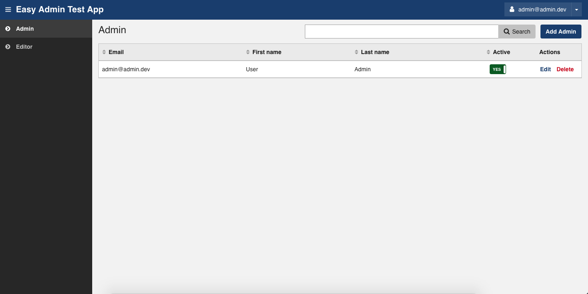

### Symfony 4 + Easy Admin

Basic Symfony 4 application setup with [EasyAdminBundle](https://github.com/EasyCorp/EasyAdminBundle) and additional [EasyAdminExtensionBundle](https://github.com/alterphp/EasyAdminExtensionBundle) for some helper functions

#### Setup

Clone, run `composer install`, `php bin/console do:sc:cr` for database creation, `php bin/console do:fi:lo -n` for some fixtures, and `php bin/console se:ru` to run built in web server

#### Users

[Doctrine Single table inheritance](https://www.doctrine-project.org/projects/doctrine-orm/en/2.6/reference/inheritance-mapping.html#single-table-inheritance) is used to manage user types. There are two predefined types/entities, `Admin` and `Editor`

#### Easy Admin Config

Configuration YAML files are located under `config/packages/easyadmin` folder, and automatically loaded in main config. Add additional YAML files in this folder, for your new entities etc.